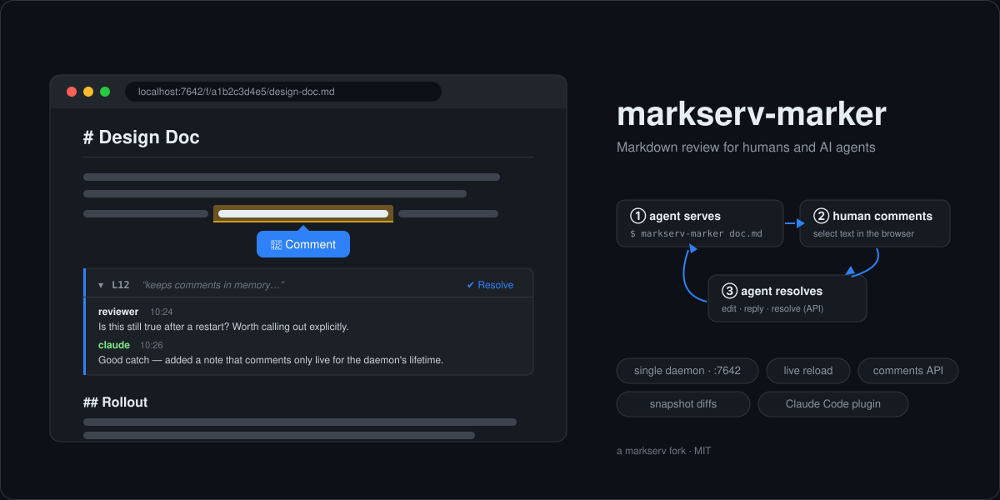

# markserv-marker

<p align="center"></p>

Single-daemon Markdown preview server with **selection-anchored review comments** — a fork of [markserv](https://github.com/markserv/markserv).

Built for the workflow where an AI agent (Claude Code etc.) serves a Markdown file, a human reviews it in the browser and leaves comments on specific lines, and the agent reads the comments back over a JSON API.

## Why fork markserv?

- **No more port conflicts.** markserv starts one server per file, so every invocation has to hunt for a free port. markserv-marker runs a single daemon on a fixed port (default `7642`); the CLI just registers files with it and prints the URL.
- **Index page.** `/` lists everything currently served, with comment counts.
- **Review comments.** Select any text in the rendered page and a floating Comment button appears; the comment records the enclosing source-line range plus the selected text (`quote`), which stays highlighted in the page. Comments support threads and resolve/unresolve. They live in memory for the daemon's lifetime — no files written.
- **Comments API.** Everything the UI does is available over HTTP for agents.

Everything else is markserv: GitHub-style rendering, themes, syntax highlighting, live reload while you edit.

## Install

```console
$ npm install -g markserv-marker
```

Or from source:

```console
$ git clone https://github.com/0xys/markserv-marker.git
$ cd markserv-marker
$ npm install
$ npm link        # puts the markserv-marker command on your PATH
```

Requires Node.js 20 or newer.

## Usage

```console
$ markserv-marker README.md          # registers + opens browser, prints URL
http://localhost:7642/f/a1b2c3d4e5/README.md

$ markserv-marker README.md --json   # machine-readable, no browser
{"id":"a1b2c3d4e5","url":"http://localhost:7642/f/a1b2c3d4e5/README.md",...}

$ markserv-marker status             # daemon health + registered files
$ markserv-marker stop               # stop the daemon
$ markserv-marker daemon             # run the daemon in the foreground (logs)
```

The daemon starts automatically (detached) on first use. Registering the same file twice returns the same URL. Directories can be registered too.

## Claude Code plugin

This repo doubles as a Claude Code plugin that packages the review workflow as a skill:

```console
/plugin marketplace add 0xys/markserv-marker
/plugin install markserv-marker@markserv-marker
```

Then `/markserv-marker:open-markdown <file.md>` serves a file for review, and
`/markserv-marker:review-markdown` reads the comments back, applies the feedback,
replies and resolves each thread. (Working inside a clone of this repo, the same
skills are available as `/open-markdown` and `/review-markdown`.)

## Agent workflow

With the plugin installed, a full review round-trip is two skill invocations in Claude Code:

```text
> /markserv-marker:open-markdown docs/design.md

  Claude registers the file with the daemon and opens it in your browser.
  You read it there, select any text and leave comments — threads,
  replies and resolve all work in the page.

> /markserv-marker:review-markdown

  Claude reads every unresolved thread over the API, edits the file to
  address each piece of feedback, replies to the thread (author:
  "claude") and resolves it. Ambiguous feedback gets a clarifying reply
  instead of a guessed fix. Your browser updates live via hot reload.
```

Any other agent can drive the same loop over plain HTTP:

```console
$ markserv-marker doc.md --json                # 1. serve, capture {id, url}
$ # 2. human opens the URL, selects text, leaves comments
$ curl localhost:7642/api/files/<id>/comments?resolved=false   # 3. read them
$ curl -X POST localhost:7642/api/files/<id>/comments \
    -d '{"parentId":"<id>-c1","body":"Fixed in rev 2","author":"claude"}'
$ curl -X PATCH localhost:7642/api/comments/<id>-c1 -d '{"resolved":true}'
```

## API

All request/response bodies are JSON.

| Method & path | Description |
|---|---|
| `GET /api/health` | `{name:"markserv-marker", version, pid, startedAt, port, files}` |
| `GET /api/files` | Registered files with comment counts |
| `POST /api/files` | `{path}` → `201 {id, url, created:true}` (200 + `created:false` if already registered) |
| `GET /api/files/:id` | One registration |
| `DELETE /api/files/:id` | Unregister (drops its comments) |
| `GET /api/files/:id/content` | `{path, lines, content}` — raw markdown for line mapping |
| `GET /api/files/:id/comments` | Threads; filters: `?resolved=false`, `?since=<ISO>` |
| `POST /api/files/:id/comments` | Root: `{line}` or `{lineStart, lineEnd}` + `{body, author}`, optional `{quote}` (the selected text) and `{quoteIndex}` (which occurrence of it, 0-based). Reply: `{parentId, body, author}` |
| `DELETE /api/files/:id/comments` | Bulk-delete comments; `?resolved=true` clears only resolved threads |
| `PATCH /api/comments/:id` | `{resolved: true\|false}` and/or `{body}` (resolve works on thread roots only) |
| `DELETE /api/comments/:id` | Delete (a root takes its replies with it) |
| `POST /api/shutdown` | Stop the daemon |

Comment ids look like `<fileId>-c1`. Line numbers are 1-based and refer to the Markdown source; rendered blocks carry them as `data-source-line` / `data-source-line-end` attributes.

When a root comment is created the server narrows the reported block range down to the lines the `quote` actually touches and snapshots exactly those lines. A block can contain the same short quote more than once, which is what `quoteIndex` disambiguates.

Each thread returned by `GET .../comments` carries `snapshot` (`{lineStart, lineEnd, text}` as the lines were when the comment was written), `currentText` and `changed` (boolean). The thread's own `lineStart`/`lineEnd` are re-anchored on every read: edits elsewhere in the file move the commented text, so they report where that text sits **now**, while `snapshot.lineStart` keeps recording where it was written. `changed` is true only when the commented text itself was edited, not when it merely moved; the browser UI then shows an "⚠ edited" badge with an inline diff, and agents can use the same fields to detect that a comment refers to stale text.

## Security

The daemon binds `localhost` and has **no authentication**. Anyone who can reach the port can read every registered file and its directory. Do not use `--address 0.0.0.0` on a machine others can reach.

## Development

```console
$ npm install
$ npm test      # ava
$ npm run lint  # xo
```

## Credits

markserv-marker is a fork of [markserv](https://github.com/markserv/markserv) v1.18.0
by Alistair G MacDonald (F1LT3R). The GitHub-style rendering, themes, live reload
and directory listings all originate there.

Bundled third-party assets:

- File icons from [Material Icon Theme](https://github.com/PKief/vscode-material-icon-theme) by Philipp Kief (MIT)
- Theme styles derived from [github-markdown-css](https://github.com/sindresorhus/github-markdown-css) by Sindre Sorhus (MIT)
- Syntax-highlighting styles from [highlight.js](https://github.com/highlightjs/highlight.js) (BSD-3-Clause)

## License

MIT — see [LICENSE](LICENSE). Original work copyright Alistair G MacDonald;
modifications copyright 0xys.
